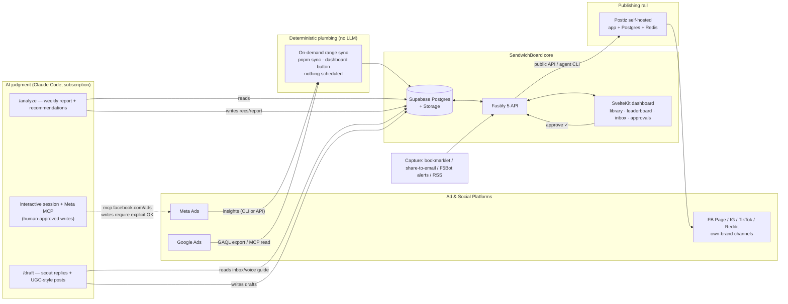

# 02 — Architecture

## System diagram

## Components

**Monorepo (pnpm workspaces).** `apps/web` — SvelteKit 2 / Svelte 5 dashboard. `apps/api` — Fastify 5 (TypeScript): auth, CRUD, ingestion workers, Postiz proxy, inbox capture endpoints. `packages/core` — zod schemas + shared types (the single definition of every table row and every platform metric shape). `docs/plan` — this set. `prompts/` — versioned prompt templates for `/analyze` and `/draft` (prompts are code; they get PRs).

**Database — Postgres-first.** SandwichBoard targets **vanilla Postgres 15+** with no provider-only features in core; any Postgres works via `DATABASE_URL` (home-server container, Supabase, Neon, RDS). Postgres is the warehouse — metric volume is megabytes per year. **File storage sits behind a tiny adapter**: `local-fs` (default), `s3` (MinIO or any S3-compatible), or `supabase-storage`. **Auth is single-operator**: app session login, optionally fronted by Cloudflare Access — no managed-auth dependency. Reference deployment: **Postgres 16 container beside Postiz on the home server**. `/analyze` connects through `ANALYST_DATABASE_URL` (read-only role) via a generic Postgres MCP or psql, identical across backends.

**Ingestion.** A plain command, run when a human runs it: `pnpm sync` locally or a "Sync now" button in the dashboard hitting an authenticated API route. It is **range-based catch-up by design** — each run computes a per-account watermark (max snapshot date) and pulls everything from there to yesterday, so weekly, daily, or erratic cadence all produce the same correct result. Deterministic code with retries, idempotent upserts keyed on `(ad_external_id, date)`, a dead-letter table for unparseable rows, and a dashboard **staleness banner** ("last synced N days ago"). No LLM anywhere in this path. Operators who want automation wrap this same command in their own cron/systemd timer (`06` appendix); the repo ships none.

**AI layer.** Claude Code, always in the operator's own session on their own subscription — SandwichBoard ships prompt templates and slash commands, never API calls, and contains no Anthropic credentials. Three modes, all human-invoked: `/analyze` (reads warehouse via the DB-enforced read-only role, writes report + recommendations), `/draft` (turns inbox items into drafts using a versioned voice guide), and interactive campaign management with the official Meta Ads MCP attached (reads freely; writes only with the operator in the loop, per guardrails in `06`). The Monday-morning `/analyze` ritual is the designed cadence, not a fallback.

**Publishing rail.** Postiz self-hosted (three containers: app, Postgres, Redis, behind Caddy/Cloudflare Tunnel). SandwichBoard never talks to social platform posting APIs directly — it hands approved drafts to Postiz via its public REST API (`POST /public/v1/posts`, `type: draft|schedule|now`) or the official `postiz` agent CLI, and reads back `releaseURL` + state. This keeps ~28 platforms' posting quirks out of our codebase permanently.

## Deployment topology

- **apps/api + apps/web:** either alongside everything else on the home server (compose service + Cloudflare Tunnel — the all-$0 topology) or a small Fly machine with Cloudflare in front; the code is identical, only where the container runs.
- **Postiz (self-hosted):** docker compose (`gitroomhq/postiz-app`, AGPL-3.0) on the home server behind Cloudflare Tunnel. The home server's **residential egress IP** also matters: Reddit 403s unauthenticated reads from datacenter IPs (`04`), so RSS/read fallbacks work from home where they would fail from Fly.
- **Job invocation:** no shipped scheduler anywhere — sync/analyze/draft are `pnpm` commands and dashboard buttons behind auth. The repo contains zero `schedule:` triggers in CI and zero cron manifests.
- **Secrets (Infisical, BYO):** all runtime configuration lives in the operator's own Infisical project and is **injected at process start** — locally via `infisical login` + `infisical run -- pnpm dev`, in deployed environments via an Infisical machine identity whose client-id/secret pair is the only credential stored outside Infisical (Fly/host secrets; it can read the vault and nothing else). Application code is deliberately **Infisical-agnostic**: it reads `process.env` through one zod-validated config module and nothing else, so Infisical is the delivery mechanism, not a code dependency — minimal lock-in, and a plain `.env` still works for contributors who refuse the happy path. Infisical itself is open source and self-hostable if the cloud dependency ever chafes. gitleaks guards the repo either way. SandwichBoard holds the Postiz API key (via Infisical), never vice-versa.

## Key decisions (locked)

1. **Postgres as warehouse** — no Airbyte/ClickHouse; at this volume an ELT platform is more maintenance than ~200 lines of ingestion code, and the naming-convention join is custom logic either way.
2. **Postiz over hand-rolled posting** — platform posting APIs are the highest-churn surface in this domain; delegate them to a maintained project and talk to it over one REST API.
3. **Official MCPs over custom API clients** for ad-platform access; custom Marketing-API code survives only as ingestion Plan B.
4. **Recommendations as data, not chat** — `/analyze` writes tables so history accumulates and next week's run can score last week's advice.
5. **Tool-agnostic core** — nothing in `packages/core` imports platform SDKs; connectors live behind one interface in `apps/api/src/connectors/*`.
6. **Infisical injection, never stored secrets** — SandwichBoard's database holds no one's tokens; env-injection keeps the app twelve-factor and custody with each operator. No Infisical SDK imports in app logic.
7. **Postgres-first, Supabase-optional** — an open-source self-hosted tool must run on any Postgres for $0; storage and auth hide behind adapters, managed Postgres is a config choice.
8. **Manual-first, no shipped schedulers** — AI runs spend the operator's subscription deliberately; range-based catch-up makes scheduling optional rather than load-bearing.
